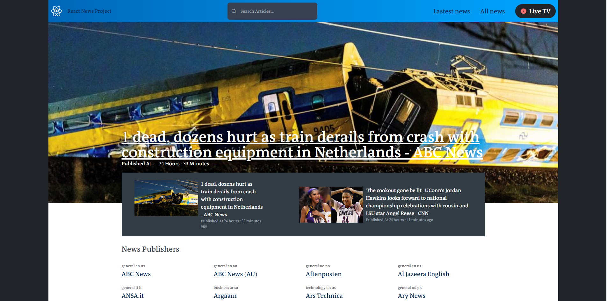

# the-gym-news-website

This is a [React.js](https://reactjs.org/) project bootstrapped with vite [`npm create vite@latest todo-context -- --template react`](https://vitejs.dev/guide/).

# the-gym-news-website

## Welcome! 👋

This is a solution to the Gym Traning. The Gym challenge help us to improve our coding skills by building realistic projects.Once you have completed the course above, go through these exercises
For each of thIS project, create a GitHub repo for it, use react.
In this exercise, we will use reactjs,redux, tailwind.
These exercises will help you apply the basic concepts of React through tiny projects. Once you finish this exercise, you'll know you've got the basics down. Then you can start learning more advanced concepts, and build more complicated projects

## Content

- [the-gym-calculator-react](#the-gym-news-website-react)
- [Welcome! 👋](#welcome)
- [The Exercise](#the-challenge)
- [Screenshot](#screenshot)
- [Links](#links)
- [My process](#my-process)
- [Author](#author)
- [Connect Us](#connect-us)

### The challenge

Technological Requirements:

1. All news publishers, news articles, article contents, article images and article titles mentioned in the requirements below should be fetched using the News API.
2. Use JavaScript ES6 features such as arrow functions, template literals, destructuring, let and const, classes, spread and rest operators.
3. Use promises and async/await to improve code readability and maintainability.
4. Use Redux to fetch and store the states of articles and sources.
5. Use a public github repository.
6. Deploy the application to Netlify.

### Screenshot

### Links

- Live Site URL Open [Challenge](https://deploy-preview-1--storied-pasca-023e4e.netlify.app/) with your browser to see the result.

## My process

- React
- Tailwind css
- Redux

## Author

- Twitter - [@ibrahim_Bagalwa](https://twitter.com/ibrahim_Bagalwa)
- LinkedIn - [ibrahim-bagalwa](https://www.linkedin.com/in/IbrahimBagalwa)

## Connect Us:

   

---

